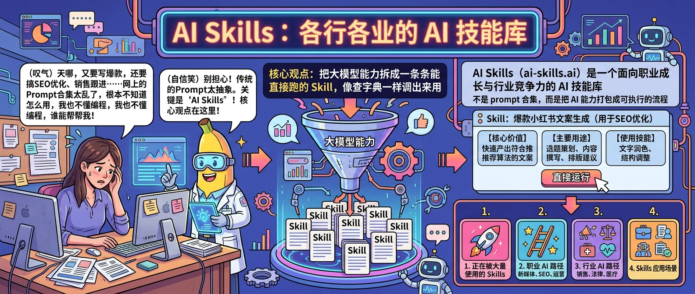
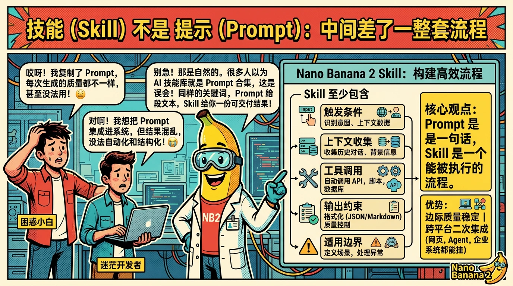
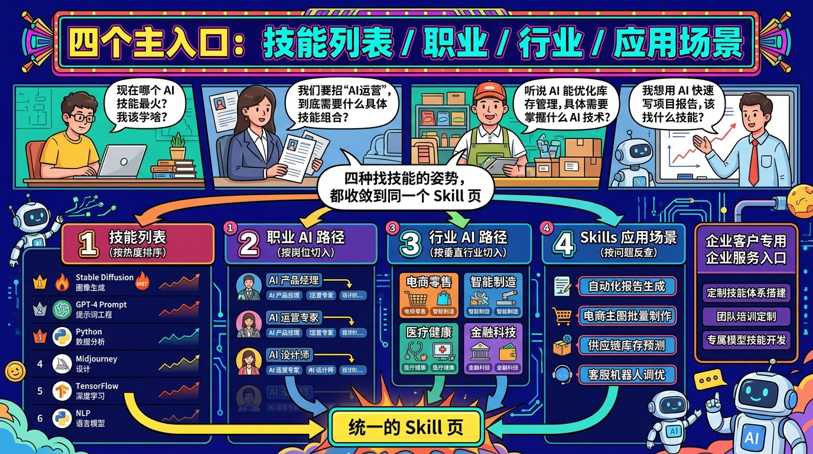
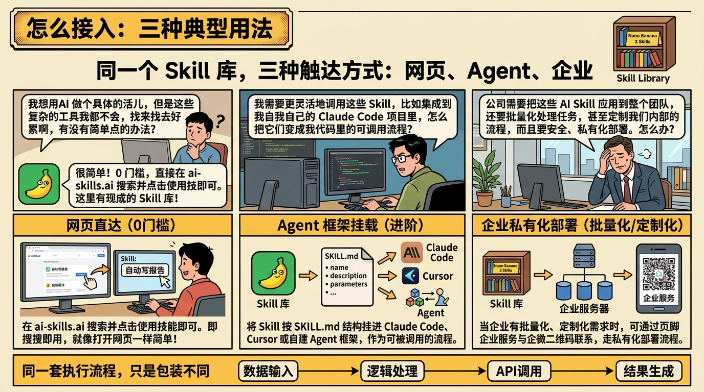

# AI Skills 站点导览：像查字典一样用 AI

> 大多数人用 AI 还停在「问一句答一句」。AI Skills（ai-skills.ai）想换一种姿势：把 AI 能力拆成一条条能直接执行的 Skill，像查字典一样调出来用。这篇 README 讲清楚这个站点是什么、装了什么、谁应该怎么用它。

## AI Skills 是什么：一个能直接查的技能库

AI Skills（[ai-skills.ai](https://ai-skills.ai/)）是一个面向各行各业的 AI 技能库。站点首屏给的定义很直接：「为你的职业发展、行业竞争力，增加更多可能。」

翻译成人话：这里不放论文、不讲 PPT，只放**能让你明天就用上的 AI 技能**。每个 Skill 都有三个固定栏目：

- **核心价值**——用一句话讲清楚这个技能解决什么问题
- **主要用途**——列出它最常被用来干什么
- **使用技能**——一个按钮，点进去就能跑

举首屏的例子：抖音赛道的创作者想知道「平台流量在哪」，对应的 Skill 叫「抖音流量分配大盘」，打开就是实时更新的大盘图和方向占比，不用自己再搭监测脚本。另外两个同系列 Skill 是「抖音全网实时热点」和「抖音上升热点选题助手」——一个告诉你全网最热的是什么，一个帮你把热点拆成可拍的选题。

## Skill 不是 Prompt：中间差了一整套流程

很多人第一次看到「AI 技能库」，以为就是 Prompt 合集。这是个常见误会。

Prompt 是一句话，Skill 是一个**能被执行的流程**：它至少包含触发条件、上下文收集、工具调用、输出约束和适用边界。同一个关键词，Prompt 给你一段文本，Skill 给你一份能交付的结果。

这也解释了为什么 AI Skills 上的每个条目都挂着「使用技能」入口——背后接的是已经调通的 Agent 工作流，不是一段需要自己再 debug 的 prompt 模板。这件事意味着两点：

1. **边际质量稳定**：不会因为你 prompt 写得不够好就翻车
2. **可被二次集成**：同一个 Skill 能被放进不同的客户端（网页、Agent、企业系统）

对多数非 AI 岗位来说，这一层封装非常关键——没人愿意花一个下午去调一句 prompt。

## 四个主入口：技能列表 / 职业 / 行业 / 应用场景

站点顶部导航给了四条主线，对应四种找技能的姿势：

| 入口 | 怎么查 | 适合谁 |
| --- | --- | --- |
| **正在被大量使用的 Skills** | 按热度排序，看别人已经在用什么 | 不确定从哪开始的新用户 |
| **职业 AI 路径** | 按岗位/职业切入，找匹配本职工作的技能 | 个人职业成长场景 |
| **行业 AI 路径** | 按行业切入，找行业专属的垂直技能 | 行业一线岗位、企业采购方 |
| **Skills 应用场景** | 按「要解决的问题」反查 | 已有明确问题的资深用户 |

这种「四象限导航」的好处是**任何一种姿势都能收敛到同一个 Skill 页**——不会因为你不知道自己属于哪个职业就找不到。对企业客户，还有一个「企业服务」入口对接定制化需求。

## 谁在用：从内容创作者到行业一线岗位

从站点目前公开的内容看，AI Skills 的典型使用者大致分三类：

- **新媒体 / 内容创作者**：抖音、小红书、视频号的选题与流量分析——前面提到的三个抖音 Skill 就是这类用户的日常工具
- **SEO / 运营 / 增长岗**：关键词研究、竞品分析、内容刷新、排名追踪等一整套站内/站外优化流程
- **行业专业岗位**：法律、医疗、教育、销售、客服等细分行业，各自挂一条垂直路径

对大部分用户来说，真正有用的不是「我知道 AI 很强」，而是「下班前这个报表怎么交」。AI Skills 的内容就是按这个粒度切出来的——每条 Skill 对应一件具体能被交付的事。

## 怎么接入：三种典型用法

目前有三种推荐姿势：

1. **直接在站点用**：打开 [ai-skills.ai](https://ai-skills.ai/)，顶部搜索框输关键词（比如「抖音热点」「SEO 审计」「竞品分析」），点「使用技能」即可。这是 0 门槛上手的方式。
2. **放进自己的 Agent**：如果你在用 Claude Code / Cursor / 自建 Agent 框架，多数 Skill 都支持按 `SKILL.md` 结构被挂载——把 Skill 路径加进 agent 配置，就能作为一条可被调用的流程使用。
3. **企业对接**：对有批量化、定制化需求的公司，站点页脚有「企业服务」与企微咨询入口，支持按行业/岗位做私有化部署。

三种姿势本质上是**同一个 Skill 库的三种触达方式**——底下跑的是同一套执行流程，只是包装不同。

## 产品态度：不堆数量，堆可执行结果

站点 footer 有一句小字值得放大看一下：**「面向职业成长与行业竞争力场景，强调可执行结果与持续能力沉淀。」**

翻译成做产品的语言：

- **不堆 Skill 数量**——不以「目录里有 10 万个 prompt」为卖点
- **强调可执行**——每个进入目录的 Skill 都要有真实跑通的路径
- **强调持续迭代**——Skill 会随着模型和平台变化不断更新，不是一次性文档

这也是为什么首页愿意公开合作的模型与云服务商（阿里云、豆包、OpenAI、Anthropic、Kimi、DeepSeek、火山引擎）——底层基座会变，上层 Skill 层需要和这些能力源持续同步。

## FAQ

**Q1：AI Skills 和 ChatGPT、Kimi 这些 AI 应用有什么区别？**
答：AI Skills 是「场景层」，ChatGPT/Kimi 是「模型层」。前者告诉你「这个岗位具体可以用 AI 干什么、怎么干」，后者提供底层对话能力——两者是配合关系，不是替代关系。

**Q2：Skill 和 Prompt 到底差在哪？**
答：Prompt 是一句指令，Skill 是一个封装好的流程。Skill 至少包括触发条件、工具调用、输出结构和适用边界，相当于一个 mini Agent，结果稳定且可复用。

**Q3：非技术岗能用吗？**
答：完全可以。大多数 Skill 在网页端直接「按钮式使用」，不需要写任何代码。高级用户才需要把它挂进 Claude Code / Cursor 做集成。

**Q4：内容是免费的吗？**
答：基础技能免费浏览和使用；深度定制、私有化部署、行业方案走「企业服务」入口，具体合作方式可通过页脚企微二维码咨询。

**Q5：我的行业没找到对口的 Skill 怎么办？**
答：先用顶部搜索框搜一遍；实在没有可以走「企业服务」提需求，或在关于页留下反馈——行业路径本身还在持续补齐。

## 结论

AI Skills（[ai-skills.ai](https://ai-skills.ai/)）给 AI 的用法一个更具体的答案：不是再训练一个更大的模型，而是把已有模型的能力拆成一条条能被你今天就用上的 Skill。打开首页，按职业、行业或应用场景三选一，找到对应的 Skill，点「使用技能」——这就是它希望你的第一次体验。
