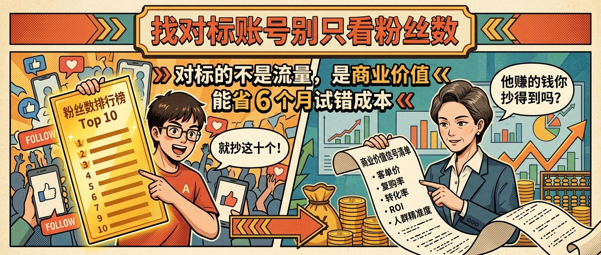
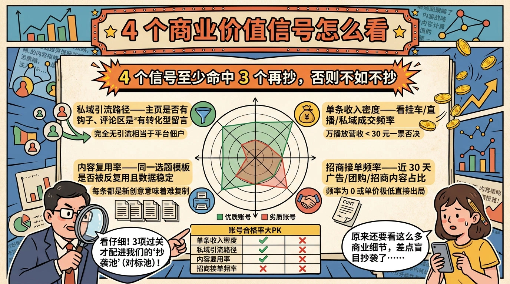
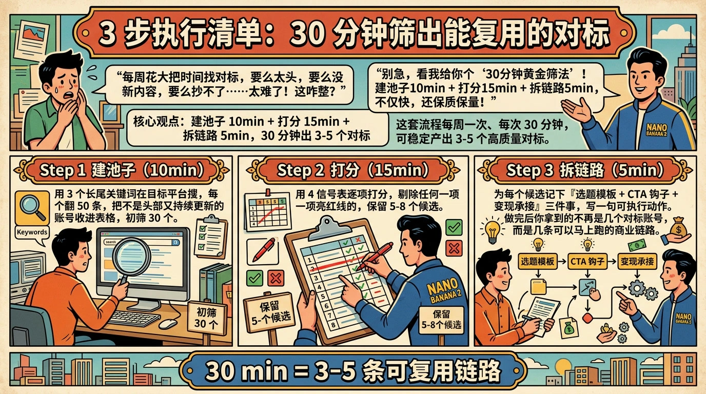
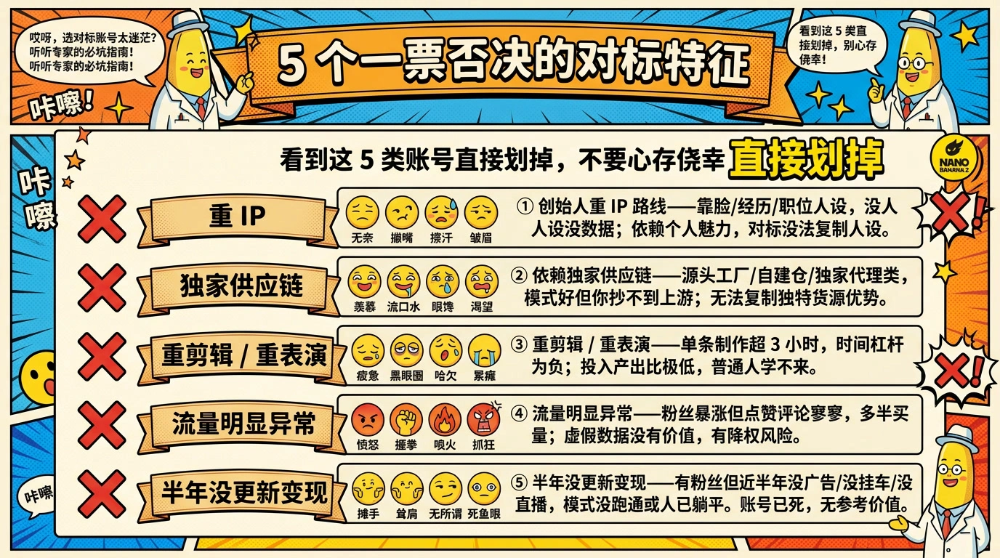

# 找对标账号别只看粉丝数：4 个信号帮你避开 90% 的踩坑

> 选错对标账号，等于给自己挖了一个三个月的坑：内容方向是对的、数据也涨了，但就是不赚钱。问题不在执行，而在你一开始挑对标的标准就错了——你看的是流量，应该看的是商业价值。

## 误区：粉丝数是最容易骗自己的指标

大部分人找对标的第一反应是『搜行业关键词，按粉丝数排序，挑前十个跟着抄』。这套流程看起来很科学，但只对 MCN 拼播放量有用，对一个想靠这个账号赚钱的个体来说，是最危险的起点。

粉丝数解决不了三个根本问题：第一，粉丝是不是『精准买单人群』；第二，账号是否有可复制的变现路径；第三，对方的高粉丝数是花钱买的还是平台算法红利期送的。这三件事都不知道的情况下，你抄的只是表象——封面字号、镜头节奏、选题套路——但抄不到对方真正赚到钱的那条暗线。

更糟的是，粉丝数高的账号往往已经过了红利期，模式被算法压制，你跟着进场反而是接最后一棒。真正值得对标的，往往是 **5000-3 万粉、最近 3 个月转化在加速** 的中腰部账号。

## 对标的真正用途：复用商业模式，不是抄爆款

找对标账号的本质，是 **省下别人验证商业模式的 6-12 个月**。爆款只是一个结果，真正能复用的是产生爆款背后的整套链路：选题方法、内容结构、CTA 钩子、私域承接、SKU 设计、复购触发。

抄一条爆款视频，最多换来一周的流量；复制一套商业模式，能让你直接跳过冷启动期。所以判断一个账号值不值得对标，关键问题永远只有一个：**它的赚钱方式我能不能 1:1 搬过来？**

如果搬不过来——比如对方靠创始人 IP、地理位置、独家渠道——粉丝再多也只是个看着热闹的样板间，不是你能住进去的家。

## 4 个商业价值信号怎么看

下面 4 个信号按优先级排序，建议每个候选对标账号都按这张表打一次分：

| 信号 | 怎么看 | 不及格红线 |
| --- | --- | --- |
| 单条收入密度 | 看挂车 / 直播 / 私域成交频率，估算单万播放营收 | 万播放营收 < 30 元 |
| 私域引流路径 | 主页是否有钩子，评论区是否有转化型留言 | 完全无引流 = 平台佃户 |
| 内容复用率 | 同一选题模板是否被反复使用并保持稳定数据 | 每条都是新创意 = 难复制 |
| 招商接单频率 | 近 30 天广告 / 团购 / 招商内容占比 | 频率为 0 或单价极低 |

**信号 1 单条收入密度**：粉丝量再大，万播放赚不到钱也是泡沫。**信号 2 私域引流路径**：纯靠平台分发的账号天花板很低，能把流量沉到私域才有杠杆。**信号 3 内容复用率**：能反复套同一模板还有数据的账号，说明流程跑通了，你才能学得会。**信号 4 招商接单频率**：广告主用真金白银投票，比平台数据更可信。

4 个信号至少满足 3 个再纳入对标池，否则不如不抄。

## 3 步执行清单：30 分钟筛出能复用的对标

这套流程亲测每周一次，每次 30 分钟，可以稳定产出 3-5 个高质量对标。

1. **建池子（10 分钟）**：用 3 个长尾关键词在目标平台搜，每个关键词翻 50 条，把『不是头部又有持续更新』的账号收进表格，初筛 30 个。
2. **打分（15 分钟）**：用上一节那张 4 信号表，给每个账号打分，剔除任何一项亮红线的，保留 5-8 个候选。
3. **拆链路（5 分钟）**：对每个候选账号，记下『选题模板 + CTA 钩子 + 变现承接』三件事，写一句话能复制的执行动作。

做完这 30 分钟，你不再是『有几个对标账号』，而是 **有几条可以马上跑的商业链路**——这是天差地别的两件事。

## 5 个一票否决的对标特征

看到下列任一特征，直接划掉，不要心存侥幸：

- **创始人重 IP 路线**：靠脸 / 靠经历 / 靠职位人设的账号，没有人设就没有数据，复制不到。
- **依赖独家供应链**：源头工厂 / 自建仓 / 独家代理类账号，模式好但你抄不到上游。
- **重剪辑 / 重表演**：单条制作成本超过 3 小时的账号，时间杠杆为负，撑不到回本。
- **流量明显异常**：粉丝增速与互动率严重背离（粉丝涨得快但点赞评论几乎为零），多半是买量账号。
- **半年没更新变现**：账号有粉丝但近半年完全没接广告 / 没挂车 / 没直播，多半模式没跑通或人已躺平。

## FAQ

**Q：找对标到底要找几个？** 同时跟 3-5 个就够，多了精力分散，少了样本不够。

**Q：4 个信号都是猜的，怎么验证？** 用『新榜 / 蝉妈妈 / 飞瓜』查近 30 天数据，再对比账号主页的钩子和评论区，估值精度足够指导决策。

**Q：对标和抄袭的边界在哪？** 对标的是结构与策略，抄袭的是文案与画面。结构可以复用，文字与镜头一定要重写。
