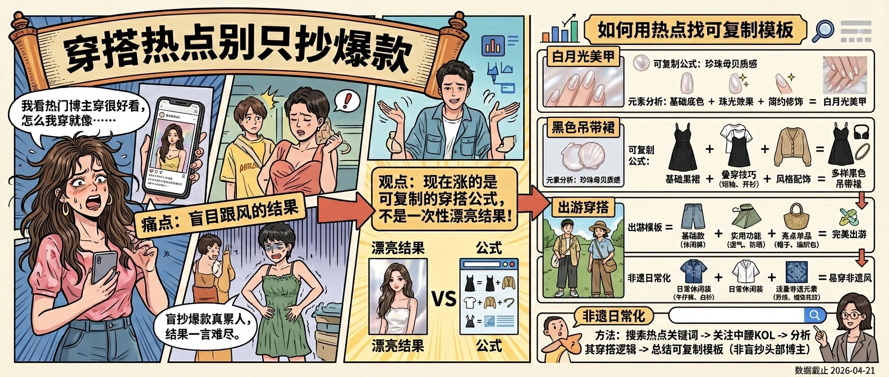
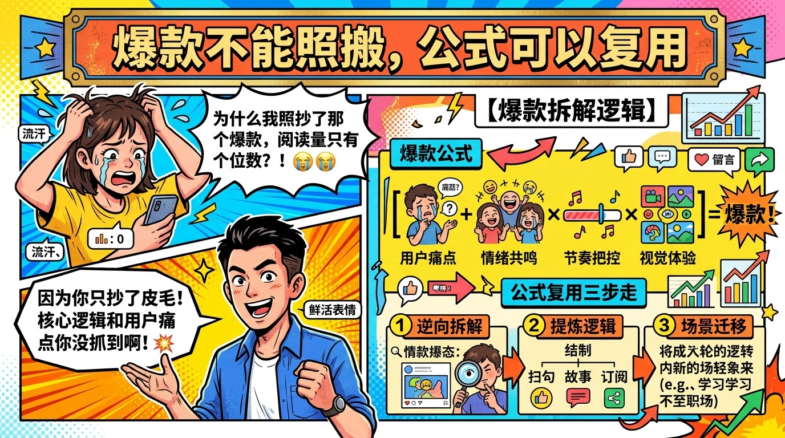
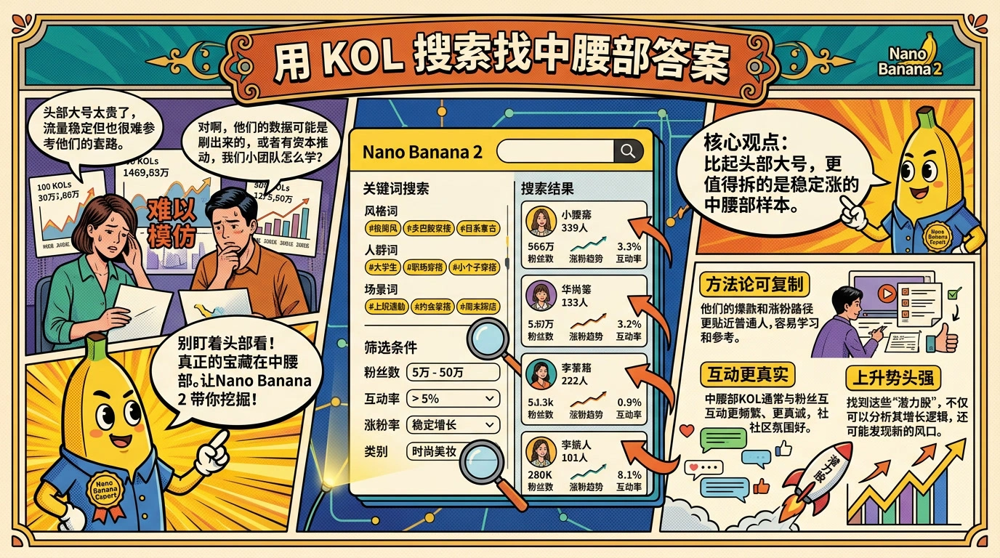

# 穿搭热点别只抄爆款

> 2026 年 4 月 21 日的时尚上升热点很说明问题：在涨的不是“某个女明星同款”，而是“穿搭公式”“白月光美甲”“出游穿搭”“非遗穿进日常”这类可复制结构。对做穿搭内容的人来说，真正该抄的不是爆款本身，而是爆款背后的模板。

## 这波穿搭热点到底在涨什么

把这一轮上涨词放在一起看，你会发现它们几乎都满足三个条件：

- **有明确场景**：出游、通勤、春夏、拍照，不是抽象的“今天很好看”。
- **有可套用公式**：黑色吊带裙万能穿搭公式、基础款穿搭、配色逻辑，本质上都是“观众看完能照做”。
- **有身份代入感**：微胖女生、短发女生、小个子男生、非遗日常化，这些词让用户一眼就知道“是不是在说我”。

这也是为什么纯展示型穿搭越来越难起量。用户现在不是只想看“你穿得好”，而是想知道：**我能不能立刻学会、今天就用上、发出去也像样**。

## 爆款不能照搬，公式可以复用

很多账号做穿搭做着做着就没了，核心问题不是审美差，而是一直在抄“结果”，没有拆“公式”。

拿“黑色吊带裙万能穿搭公式”这类题目举例，它真正的结构通常是：

1. 一个用户高频会遇到的单品
2. 一个明确的场景承诺
3. 三步以内的搭配逻辑
4. 一张结果对比图或上身效果

同理，“白月光美甲”背后其实是“颜色命名 + 气质承诺 + 上手难度低”的组合；“非遗穿进日常”背后是“传统元素 + 现代通勤 + 文化情绪价值”的组合。

所以你不该问“这条我能不能模仿”，而应该问：

- 这条爆的是哪一个单品？
- 它承诺的场景是什么？
- 用户为什么会愿意收藏？
- 我能不能把这套结构换到自己的衣橱、体型、人设上？

如果答案是能，那你复用的是模板；如果答案只是“她本人穿好看”，那你抄的是运气。

## 用 KOL 搜索找中腰部答案

头部博主能给你方向，但很少能给你可复制方法。真正值得拆的，往往是 5 万到 50 万粉、更新密度稳定、评论区收藏意图明显的中腰部账号。

`douyin-kol-search` 在这里的价值，不是找“最红的穿搭博主”，而是帮你找：

- 这个细分风格最近是谁在稳定涨
- 哪些博主靠“公式内容”起量，而不是靠脸和团队
- 哪些账号的评论区在反复问同一类问题

一个很实用的搜索顺序是：

1. 先搜风格词：如“通勤穿搭”“白月光美甲”“出游穿搭”
2. 再搜人群词：如“小个子”“微胖”“短发女生”
3. 最后搜场景词：如“见家长”“五一出游”“上班通勤”

这三轮搜下来，你会很快看到哪些是一次性热梗，哪些是能稳定周更的内容结构。

## 一周穿搭内容矩阵怎么排

如果你现在要吃这波穿搭流量，不要每天靠感觉临时想题目。更稳的排法是把内容拆成三层：

- **吸引点击层**：热点词外壳，比如“白月光”“出游”“非遗”“春夏”
- **建立信任层**：明确人群、体型、预算、场景，比如“微胖女生也能穿”“200 元以内搞定”
- **促进收藏层**：公式、配色、避雷、清单，让用户愿意保存

一个 7 天矩阵可以这样排：

1. 周一发“热点词 + 场景”打开流量口
2. 周三发“同一逻辑下的平替 / 低预算版本”
3. 周五发“上身效果 + 避雷点”
4. 周末做合集或评论区高频问题答疑

这样做的好处是，单条视频不再只负责爆，而是开始承担不同任务。穿搭赛道最怕“每条都想爆”，因为那会逼着你不断追新的热词，最后内容越来越碎。

## FAQ

**Q：穿搭热点更新太快，来不及追怎么办？**  
不要逐条追。先找 2 到 3 个持续上涨的模板词，比如“场景穿搭”“万能公式”“基础款”，用它们去包住更小的热点。

**Q：没有很多衣服还能做吗？**  
能。衣服少更应该做公式内容。用户真正爱看的是“有限衣橱怎么搭出变化”，而不是每天换新。

**Q：穿搭和美甲要放在一个账号吗？**  
只要服务的是同一类用户，可以放一起。比如“上班通勤女生”“出游拍照党”，内容在同一审美和场景下反而更容易形成系列。

## 结论

这轮穿搭上涨词已经很明确地告诉你：平台更偏爱“用户看完能照着做”的内容，而不是单纯的美。别再只追爆款封面和博主本人，先拆结构，再用 `douyin-kol-search` 找到能复制的中腰部样本，你的穿搭内容才会从偶尔撞运气，变成稳定能出成绩。
