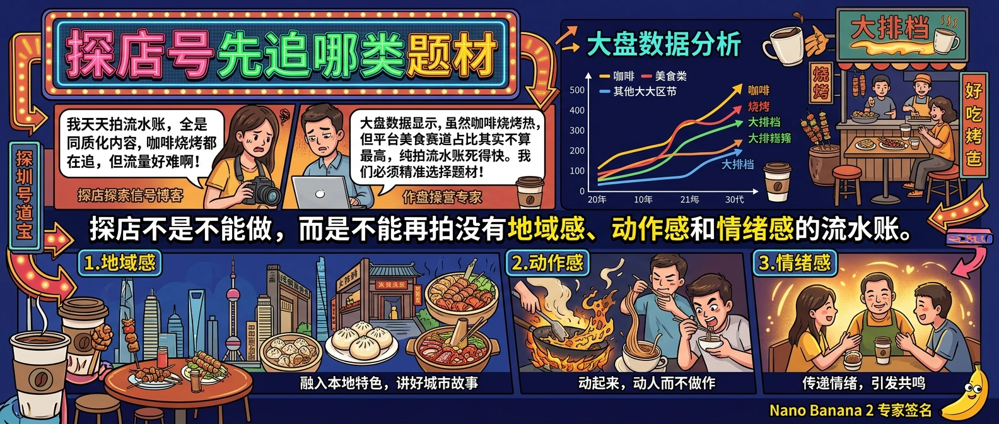

# 探店号先追哪类题材

> 这一轮抖音热词里，`贵州烧烤大排档真的不一样`、`上天入地我最爱喝咖啡` 这类内容都在冒头。但平台流量分配大盘里，美食并不是高占比赛道。这代表一个现实：探店号不是不能做，而是不能再拍“这家店真好吃”这种没有结构的内容。

## 为什么普通探店越来越难起量

探店内容难，不是因为观众不爱看吃的，而是因为平台已经被三类低效内容塞满了：

- 只拍门头、菜单、上菜
- 只有夸，没有判断
- 只说“性价比高”，没有具体场景

这种内容的问题在于，用户看完不会行动。既不会收藏，也不会转发，更不会立刻决定“我要去”。

而最近能涨起来的美食相关词，几乎都带着更明确的可传播元素：

- **地域标签强**：贵州烧烤、大排档、夜市、地方味
- **动作感强**：现烤、拉丝、开锅、排队、围炉
- **情绪感强**：治愈、解压、夜宵、朋友聚会

探店赛道不是没需求，而是用户已经不再接受“泛泛好吃”。

## 先看大盘，决定要不要重投

`douyin-traffic-dashboard` 的意义，在探店赛道尤其重要。

因为美食往往不是平台最大流量池，这就决定了：**你不能把每一条探店都当成自然爆款来做预期**。如果大盘里美食占比一般，那你的内容就更要争取“局部绝对优势”，而不是拍成没有棱角的安全片。

更具体一点：

- 如果你本来就是本地生活号，可以继续做探店，但题材必须更极致，比如夜市、特色店、节日限定、早晚高峰对比。
- 如果你是穿搭、旅行、城市记录号，美食更适合作为“辅助题材”，和出游路线、约会、夜生活放在一起拍。
- 如果你是纯带货号，不要临时改做纯探店，除非你已经有本地供给和镜头能力。

看大盘不是为了劝退，而是为了告诉你：**探店现在要靠选题结构赢，不是靠赛道红利赢。**

## 现在更值得追的三类探店题材

### 第一类：地方感很强的夜间题材

像烧烤、大排档、夜宵街、深夜食堂，这类内容的优势是自带氛围和声音，用户更容易代入“和谁去、几点去、要点什么”。

### 第二类：可被一句话讲清楚的玩法题材

比如“这杯咖啡为什么值得专门来一趟”“这家店只推荐点这 3 个”，这种题材一开头就能建立判断，而不是只给流水账。

### 第三类：和节日或城市出行强绑定的题材

五一前后，探店内容如果能接到出游、周边游、夜生活、路线安排，转发率会明显高于单家门店介绍。

你真正该追的不是“今天哪家店火”，而是**哪种题材在当前时间点更容易和用户的实际生活绑在一起**。

## 一套够用的探店筛选表

如果你下周要排探店选题，可以先过一遍这四个问题：

1. 这家店有没有一句话能讲清的差异点？
2. 这个题材是不是跟某个具体场景强绑定？
3. 用户看完会不会立刻产生“想去”的行动？
4. 这个题材能不能延展成系列，而不只是单条？

只有前两项都成立，才值得进入拍摄。

然后再用 `douyin-realtime-hot-rise` 看最近在涨的美食相关词，用 `douyin-kol-search` 搜“烧烤”“咖啡”“夜市”“探店”等短词，找中腰部账号最近在怎么切题。别只看百万大号，因为大号可以靠品牌和剪辑起量，你不一定能复制。

## FAQ

**Q：探店号现在还值得做吗？**  
值得，但不能再拍成流水账。探店从“介绍店铺”转成“帮用户做选择”以后，价值会大很多。

**Q：是不是只适合做本地内容？**  
不是。异地探店也能做，但最好放进“旅行路线”“城市夜生活”“周末计划”这种更大场景里。

**Q：探店和带货能不能打通？**  
能。尤其是咖啡器具、露营夜宵、地方特产这类题材，很适合从内容过渡到商品或服务承接。

## 结论

探店号的机会还在，但已经从“随便拍一家店”变成了“判断哪类题材更值得追”。先看大盘，再看上升热点，最后去搜中腰部参考账号，你就能少拍很多没机会起量的内容，把时间用在更容易被收藏、转发和到店的题材上。
