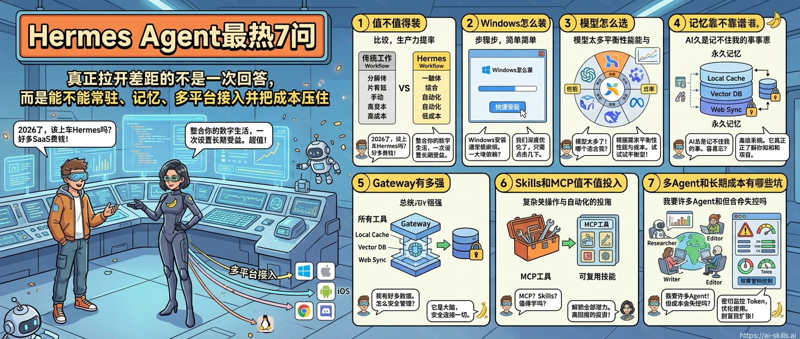
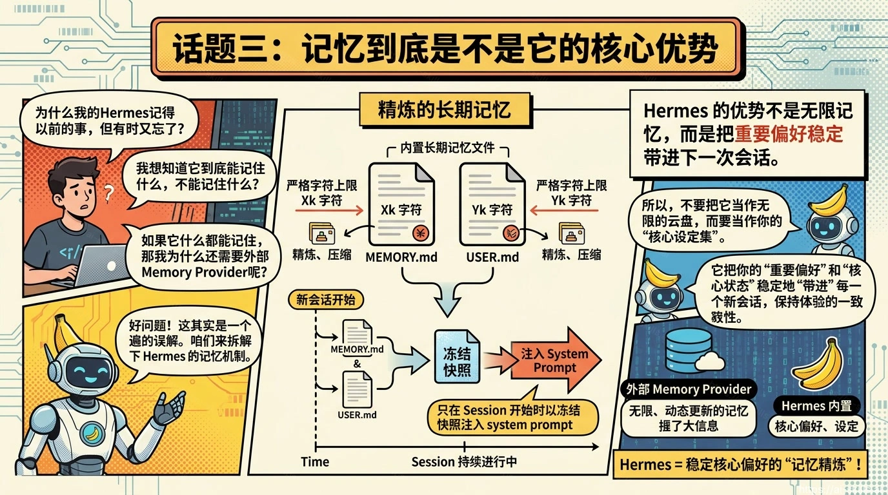
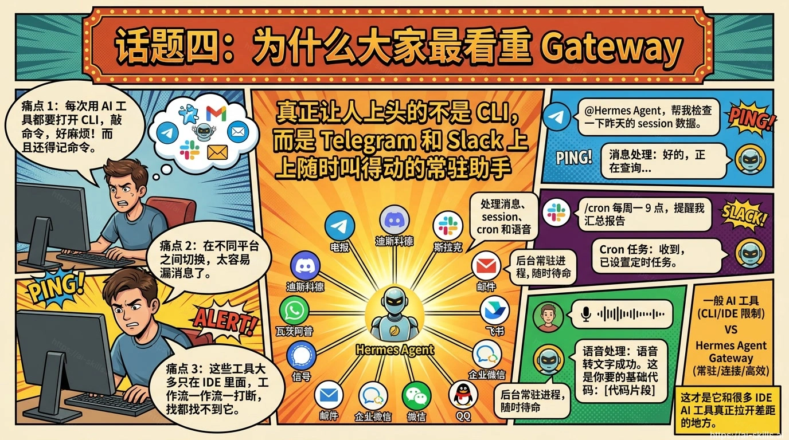
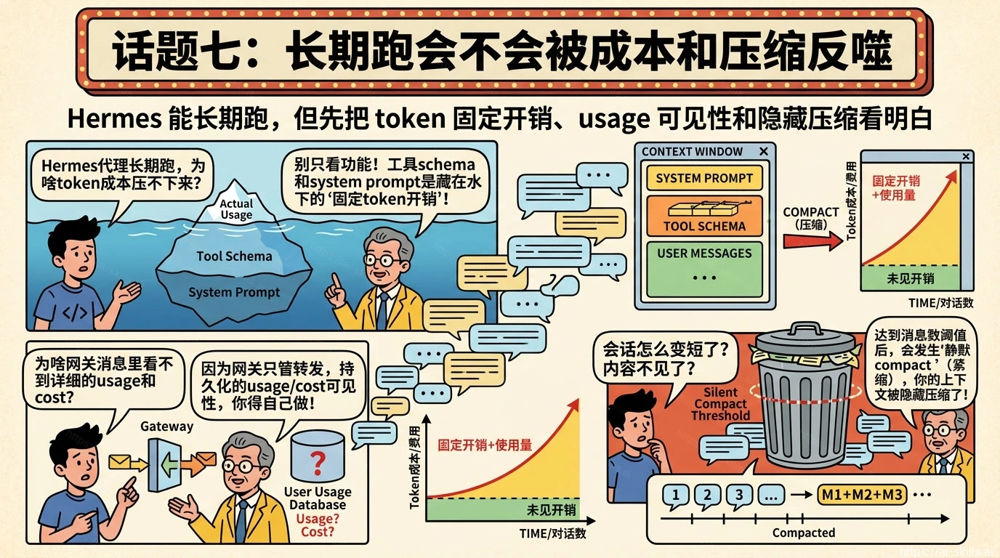

# Hermes Agent最热7问

> 截至 2026 年 4 月 21 日，我把 Hermes Agent 官方 Quickstart、Memory / Messaging / Skills 文档、官网首页和 4 月中旬公开 issue 里最密集的问题翻了一遍。下面这 7 个问题，基本就是大家现在最关心、也最影响你要不要装、怎么装、值不值得长期用的地方。

## 先看结论：Hermes Agent 适合谁

如果你想要的不是一个“只在 IDE 里陪你写代码”的助手，而是一个能在终端、Telegram、Slack、Discord、Feishu/Lark、WeCom 之间持续待命，还能带着长期记忆和技能库一起工作的 agent，那 Hermes Agent 值得认真看一眼。

它最强的卖点，不是“单轮聊天更聪明”，而是三件事同时成立：

- 它能常驻：官方文档把 Messaging Gateway 放在核心能力里，不是边角插件。
- 它能记住：内置长期记忆跨 session 生效，不用每次从头喂背景。
- 它不锁模型：Quickstart 里直接给了长长一串 provider 选择，官方首页也明确在推“先用托管、再自托管”的路径。

但 Hermes 也不是所有人都该装。只要你属于下面任一类，优先级就没那么高：

- 你只想要 IDE 里的补全、局部改代码、零配置开箱即用。
- 你不想碰终端，也不想接受 WSL2、SSH、Docker 这些基础设施概念。
- 你根本不需要“常驻助手”，只是偶尔问几个问题。

一句更直白的话：Hermes Agent 更像“长期助手”，不是“最快上手的聊天工具”。

## 话题一：安装门槛到底高不高

官方 Quickstart 给的安装路径很清楚：Linux、macOS、WSL2、Android Termux 都能走一行命令，Windows 用户则被明确引导到“先装 WSL2，再进 WSL2 终端执行安装脚本”。

这背后其实已经回答了很多用户最想问的问题：**Hermes 不是不能在 Windows 世界里用，但现在最稳的官方路径仍然是 WSL2。**

为什么这是高频问题？因为最近公开 issue 已经把痛点说透了：

- 有人专门提了 `hermes-for-win`，核心诉求就是“Windows 用户上手成本太高”。
- 也有人在追 WSL2 / Windows 文件系统桥接，说明“能装”和“装完顺手”完全不是一回事。
- 还有 ACP / WSL 路径转换相关 bug，意味着你一旦把 Hermes 接到别的编辑器或客户端，路径问题会被继续放大。

所以安装门槛的真实答案不是“有安装脚本，所以上手简单”，而是：

1. macOS / Linux 用户，上手门槛中等偏低。
2. Windows 用户，门槛依然偏高，最好接受 WSL2 才能少踩坑。
3. 企业内网、代理、受控笔记本环境里，安装体验通常比公开教程复杂一层。

如果你的团队是清一色 Mac 或 Linux，这一关不算大问题；如果是 Windows 公司本，先把 WSL2 和路径模型讲明白，省下后面一堆“明明装好了却不好用”的工时。

## 话题二：模型怎么选，为什么 64K 是硬门槛

Hermes Quickstart 把这件事说得很直接：**模型上下文至少要 64K。** 这不是“建议”，而是运行前提。文档甚至点名说，本地模型如果上下文窗口小于 64K，会在启动时被拒绝。

这也是为什么很多人刚接触 Hermes，最先关心的不是功能，而是“到底该接哪个 provider”。因为 provider 选错，后面所有体验都会歪。

我更建议按下面顺序选，而不是一上来就堆花活：

| 路线 | 适合谁 | 建议 |
| --- | --- | --- |
| Nous Portal / FlyHermes | 想最快验证价值的人 | 少折腾，先把 agent 跑起来 |
| Anthropic / OpenAI Codex / OpenRouter | 已有现成账号的人 | 质量稳定，适合做主力 |
| Custom Endpoint / Ollama / 本地模型 | 隐私、内网、自托管优先 | 先确认上下文窗口真到 64K，再谈体验 |

很多新手会犯两个错误：

- 还没把基础聊天跑通，就先上自定义 endpoint、代理路由、fallback chain。
- 看模型单价便宜，就忽略上下文窗口和工具调用稳定性。

Hermes 是重工具、重上下文、重工作流的 agent。这里选 provider，选的不是“哪家模型聊天更会说”，而是“谁能稳定扛住多步调用和长上下文”。

## 话题三：记忆到底是不是它的核心优势

是，但要理解它强在哪里，别把它想成“无限大脑”。

官方 Persistent Memory 文档把边界写得非常清楚：

- `MEMORY.md` 用来记环境、约定、项目事实，字符上限 2200。
- `USER.md` 用来记用户偏好、沟通方式，字符上限 1375。
- 这两份内容会在 session 开始时注入 system prompt，而且是**冻结快照**，中途写入的新记忆不会立刻反映到当前会话里。

这套设计的好处，是它真的能把“你是谁、项目怎么干、有哪些固定习惯”稳定带进下一次会话；坏处也同样明显：**它是精炼的长期记忆，不是无上限资料库。**

所以我对 Hermes 记忆能力的判断是：

- 如果你要记的是个人偏好、环境事实、团队约定，它很有价值。
- 如果你想拿它当完整知识库，单靠内置记忆不够。
- 如果你需要更深的跨 session 检索和结构化记忆，应该直接看官方列出的 7 个外部 memory provider，而不是逼 `MEMORY.md` 一份文件扛所有事情。

也正因为记忆是 Hermes 的核心卖点，用户对它的期待值会特别高。这里最容易失望的一点，不是“它记不住”，而是“它记得没你想得那么无限”。

## 话题四：为什么大家最看重 Gateway

因为 Gateway 才是 Hermes 和一堆“只会在桌面窗口里等你点开”的 AI 工具真正拉开差距的地方。

Messaging Gateway 文档已经把定位说得很明白：它是一个后台常驻进程，负责连接多平台、管理 session、跑 cron、投递语音消息。公开列出来的平台包括 Telegram、Discord、Slack、WhatsApp、Signal、Email、Mattermost、Matrix、DingTalk、Feishu/Lark、WeCom、Weixin、QQ，以及浏览器入口。

这意味着 Hermes 不是只能“你坐在电脑前才会工作”的 agent，而是更像：

- 你通勤路上能从 Telegram 随手叫起来的远程助手
- 你在 Slack / Discord 里能让它做巡检、查日志、给结论的值班同事
- 你在飞书或企业微信里能持续派活的内部自动化接口

这也是为什么官方首页一直在强调“先托管跑起来，再决定要不要自托管”。因为一旦 agent 真能挂在你原本就在用的沟通面上，它的价值感知会比一个单独的 CLI 强很多。

当然，Gateway 的代价也非常现实：**安全和权限必须当成一等公民。** 文档默认就是 allowlist / DM pairing，甚至明确提醒“允许所有用户访问”并不推荐。一个能执行终端命令的机器人，如果接到公开群里，出事不是小概率事件。

## 话题五：Skills 和 MCP 生态够不够深

如果你关心的是“这玩意是不是又一个只能 demo 的壳子”，那官方 Skills 和 MCP 入口基本可以让你放心一半。

从官方 Skills Hub 页面看，当前可发现的 skills 已经是 **638 个，覆盖 4 个 registry**，里面有 74 个内置、43 个 optional、521 个 community。更重要的是，Hermes 的 skills 不是一次性塞满上下文，而是按 progressive disclosure 的方式按需加载，这对 agent 这类长会话系统非常重要。

这意味着 Hermes 的“可扩展性”不是一句空话，而是已经有两层现实抓手：

1. Skills：把高频流程沉淀成可复用工作流。
2. MCP：把外部工具、数据源、内部系统接进来，不逼你换掉原来那套栈。

所以这块用户真正关心的，不是“能不能扩展”，而是“值不值得投入建设”。我的判断是：

- 个人用户，先用现成 skills，就足够感受到差异。
- 团队用户，只要你有重复流程，skills 非常值得做。
- 已经有自研平台或内部系统的团队，MCP 比“重新造一个 agent 平台”划算得多。

但也别浪漫化。第三方 skills 本质上跟代码依赖没差别，依旧要看来源、权限和维护质量。

## 话题六：多 Agent 现在值不值得重度依赖

值得用，但别过度神化，尤其别先把它当成本优化神器。

最近公开 issue 里有两个点很说明问题：

- 有人提 feature，希望 `delegate_task` 支持“按任务指定模型”，因为机械活和复杂活应该分开用不同成本档位。
- 也有人直接报 bug，说子 agent 会无视 delegation model 配置，直接继承父 agent 的模型。

这背后的结论其实很务实：**Hermes 的多 Agent 已经能提升隔离性、并行性和后台处理体验，但“细粒度模型分层”这件事还在继续打磨。**

如果你现在就把多 Agent 用在下面这些场景，通常是赚的：

- 背景调研和主会话分离
- 长任务后台跑，主聊天保持响应
- 不同工作流拆不同 profile / session

但如果你想要的是“父 agent 用贵模型，子 agent 自动降级成便宜模型，成本立刻下降”，那今天还不能太乐观。至少从最近公开 issue 看，这块仍在快速迭代期。

## 话题七：长期跑会不会被成本和压缩反噬

这是最不性感、但最决定你会不会继续用下去的一问。

Hermes 的真实挑战，从来不只是“能跑”，而是“长期跑得起、跑得稳、跑得可解释”。

最近几条 issue 把这个问题暴露得很具体：

- 有人分析了网关部署的请求，发现每次 API 调用里约 73% 可能是固定开销，主要来自工具 schema 和 system prompt。
- 有人提 feature，希望在 Discord、Telegram、Slack 里给每次回复加持久化 usage / cost footer，因为不想每次手动打 `/usage`。
- 还有人报 bug，说长会话在 `/usage` 明明只显示 34% 上下文占用时，仍然会因为 400 条消息的安全阈值被静默 compact。

这三件事放在一起，就是长期使用 Hermes 的真实用户画像：他们已经不是在问“这个 agent 酷不酷”，而是在问“我的钱花到哪去了、为什么会突然压缩、怎么避免连续工作被打断”。

如果你真打算让 Hermes 常驻，至少先做这四件事：

1. 经常看 `/usage`，别只盯模型单价。
2. 把 session 按项目、按任务拆开，不要把所有事情塞进一个永生对话里。
3. 对网关用户单独做压缩和 message hygiene 观察。
4. 默认把“固定开销”当成本的一部分，而不是只算提示词正文。

对单次体验来说，Hermes 的吸引力来自记忆和网关；对长期留存来说，真正决定生死的是成本可见性和压缩可预期性。

## FAQ

**Q1：Hermes Agent 能直接替代 Claude Code 或 Cursor 吗？**  
答：更准确的说法是“部分互补、部分替代”。如果你最看重 IDE 内联补全和编辑器体验，Cursor 仍然更顺手；如果你最看重常驻、消息入口、跨 session 和记忆，Hermes 更有优势。

**Q2：新手第一周应该怎么上手？**  
答：建议按这个顺序：先装起来，再选一个稳定 provider，把终端聊天跑通；然后再接 Gateway；确认你真的需要重复流程以后，再开始加 Skills、MCP 和外部记忆。

**Q3：如果只能盯一个坑，最该盯哪个？**  
答：看你的使用方式。Windows 用户先盯 WSL2 和路径问题；常驻网关用户先盯 usage、压缩和 session hygiene；重度多 Agent 用户先盯子 agent 的模型继承和成本分层。

## 结论

Hermes Agent 不是 2026 年最省事的 agent，但它很可能是现在最像“长期助手”的开源 agent 之一。

它真正打动人的地方，不是某一次回答多聪明，而是你能不能把它挂到真实工作流里，让它带着记忆、技能和多平台入口持续服务你。反过来说，如果你装上两天还没用到记忆、网关或重复任务自动化，那大概率说明你现在并不需要 Hermes，只是被“agent”这个词吸引了。

## 资料来源

1. [Hermes Agent Quickstart](https://hermes-agent.nousresearch.com/docs/getting-started/quickstart/)
2. [Hermes Agent Persistent Memory](https://hermes-agent.nousresearch.com/docs/user-guide/features/memory/)
3. [Hermes Agent Memory Providers](https://hermes-agent.nousresearch.com/docs/user-guide/features/memory-providers)
4. [Hermes Agent Messaging Gateway](https://hermes-agent.nousresearch.com/docs/user-guide/messaging)
5. [Hermes Agent Skills Hub](https://hermes-agent.nousresearch.com/docs/skills)
6. [Hermes Agent Official Homepage](https://hermes-agent.ai/)
7. [Issue #11876: hermes-for-win](https://github.com/NousResearch/hermes-agent/issues/11876)
8. [Issue #5925: WSL2/Windows filesystem bridge](https://github.com/NousResearch/hermes-agent/issues/5925)
9. [Issue #10995: delegate_task should support per-task model selection](https://github.com/NousResearch/hermes-agent/issues/10995)
10. [Issue #11999: delegate_task ignores subagent model config](https://github.com/NousResearch/hermes-agent/issues/11999)
11. [Issue #11701: Persistent usage/cost footer on gateway messages](https://github.com/NousResearch/hermes-agent/issues/11701)
12. [Issue #12626: Gateway can silently auto-compact at 400 messages](https://github.com/NousResearch/hermes-agent/issues/12626)
13. [Issue #4379: Token overhead analysis](https://github.com/NousResearch/hermes-agent/issues/4379)
