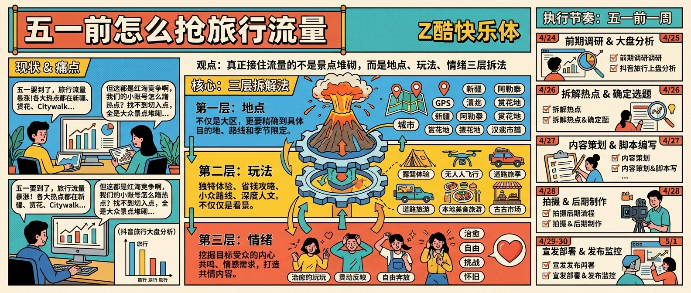
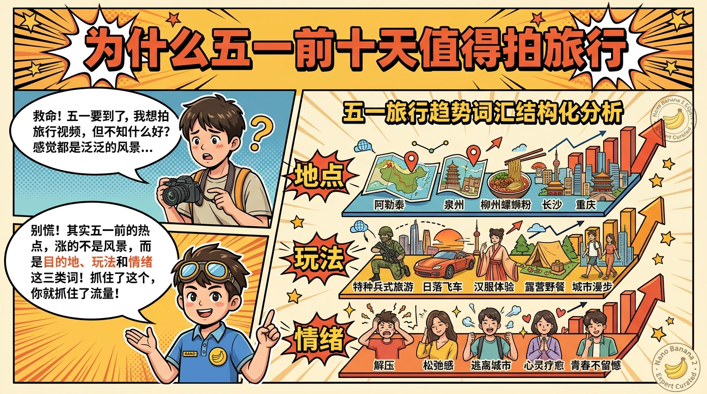
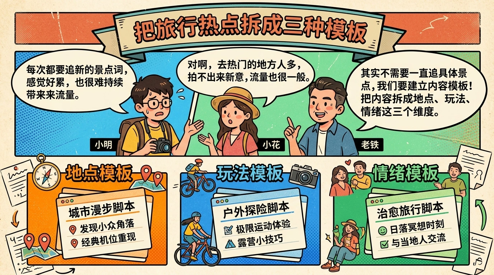

# 五一前怎么抢旅行流量

> 2026 年 4 月 21 日这轮旅行上升词很集中：`五一来新疆开启一场自由之旅`、`用colorwalk解锁城市`、`全国赏花地图大公开` 都在涨。但抖音流量分配大盘里，旅行只占约 2%。这说明它更像一个窗口机会，而不是全年都能闭眼重投的主赛道。

## 为什么五一前十天值得拍旅行

如果你只盯热搜，会觉得旅行只是“大家都在发风景”。但看上升词会发现，这一波真正涨得快的不是泛风景，而是三类更具体的内容：

- **目的地被重新命名**：比如“新疆自由之旅”“大理专门为一个镜头跑一趟”，本质上都在卖“值得现在去”的理由。
- **玩法被视觉化**：比如 `colorwalk`、赏花地图、飞拉达体验，这类词不是泛攻略，而是可以直接转成镜头脚本的玩法词。
- **情绪被包装成出行动机**：比如“觉得迷茫就来布达拉宫转一转”“泰山陪爬情绪价值拉满”，用户买的不是路书，是情绪出口。

这就是五一前十天的特点：**用户已经开始准备出门，但还没有完全做完决策**。这个阶段，内容最容易影响“我要不要去”“去了拍什么”“怎么发不土”。

## 先看大盘，再决定投多重

很多团队一看到旅行上涨，就会立刻把下周排期全改掉，这是典型的过度反应。

`douyin-traffic-dashboard` 给出的实时大盘里，当前高占比还是娱乐、站内玩法、话题互动，旅行只是小比例赛道。这意味着两件事：

1. **旅行不是现在最稳的全年主赛道**。如果你原本是穿搭、美食、探店号，没必要因为五一就把账号彻底切成旅游号。
2. **旅行是阶段性爆发场景**。它适合被拿来做专题、栏目、联动话题，而不是成为唯一内容来源。

更稳的投法是：

- 原本就做本地生活、城市内容、探店、户外的账号：可以把旅行权重直接提高到下周排期的 40% 到 60%。
- 原本做穿搭、美妆、拍照、情侣记录的账号：不要硬转旅行，应该做“出游穿搭”“出游拍照”“周边半日游”这种邻近题材。
- 原本做纯知识或强垂类账号：只借“五一”这个外壳，不碰纯景点堆砌。

判断重点不是“旅行热不热”，而是**你的账号能不能把这波旅行需求接回自己的主营能力里**。

## 把旅行热点拆成三种可拍模板

看完上升热点以后，不要直接跟拍原题目。更有效的做法，是把它拆成可复用模板。

### 模板一：目的地 + 一个反常识理由

例子像“晴西湖不如雨西湖”“这个夏天总要去一趟五台山吧”。核心不在地名，而在那个**让人停下来的理由**。

适合改成：

- 为什么五一更适合去 XX，而不是暑假
- 来 XX 不要只拍景，真正出片的是这 3 个点
- 以为 XX 只是打卡地，其实更适合治愈周末情绪

### 模板二：玩法 + 结果画面

`colorwalk`、飞拉达、赏花地图、海上法拉利兜风，本质都是“一个动作，换来一个可炫耀结果”。

适合改成：

- 这个城市最出片的半日路线
- 两小时就能完成的一次周边小冒险
- 五一别只拍路牌，这 3 个镜头更容易出圈

### 模板三：情绪 + 地点

“迷茫就来转一转”“情绪价值拉满”“终于有人讲清楚了”，都说明旅行内容已经不只是攻略，而是在卖情绪解决方案。

适合改成：

- 适合一个人出去透气的城市角落
- 想暂时逃离工作，周末就去这里
- 情侣出游最容易吵架的点，提前避开

真正能起量的旅行内容，通常不是“景点大全”，而是**地点、玩法、情绪三件事至少占两样**。

## 五一前 7 天执行表

别把旅行选题做成灵感活。五一这种窗口期最怕慢，执行节奏比创意更重要。

一个够用的 7 天流程是：

1. **T-7 到 T-5**：先用 `douyin-traffic-dashboard` 看大盘，确认旅行是否值得进入本周重点。
2. **T-5 到 T-3**：用 `douyin-realtime-hot-rise` 只筛旅行类 tag，把上涨词按“目的地 / 玩法 / 情绪”分组。
3. **T-3 到 T-2**：把每组各拆 3 个题目，只留你现有供给能拍出来的。
4. **T-2 到 T-1**：再用 `douyin-kol-search` 搜目的地或玩法关键词，看看中腰部创作者最近的拍法和切口，而不是只看头部账号。
5. **T 日发布**：一条主视频对应一条评论区补充，一条图文或合集做承接，把流量吃全。

如果你只有一个下午做排期，也不要省略“分组”这一步。没有结构地追旅行热点，最后往往会变成“你也去新疆、我也去新疆”，拍出来全都一样。

## FAQ

**Q：旅行只占 2%，是不是不值得做？**  
不是。2% 说明它不是全天候主赛道，但在五一前这种时间窗口里，旅行需求会集中爆发，足够做专题、系列和联动栏目。

**Q：本地号没有远行素材怎么办？**  
不要硬做跨省内容。把“旅行”换成“周边一日游”“城市周末半径”“本地人带你玩”，反而更容易接住同城流量。

**Q：五一过后这些题目会不会立刻失效？**  
会有一部分失效，但“出行情绪”“城市玩法”“路线模板”能继续复用，只要把节日词拿掉即可。

## 结论

五一前旅行内容确实在涨，但它不是让你把账号彻底换赛道，而是给你一个短窗口去做更高点击、更强转发的专题。先看大盘，再看上升热点，最后把题目拆成你能稳定生产的模板，这样你抢到的才不是一次运气，而是一套下次还能复用的流量方法。
