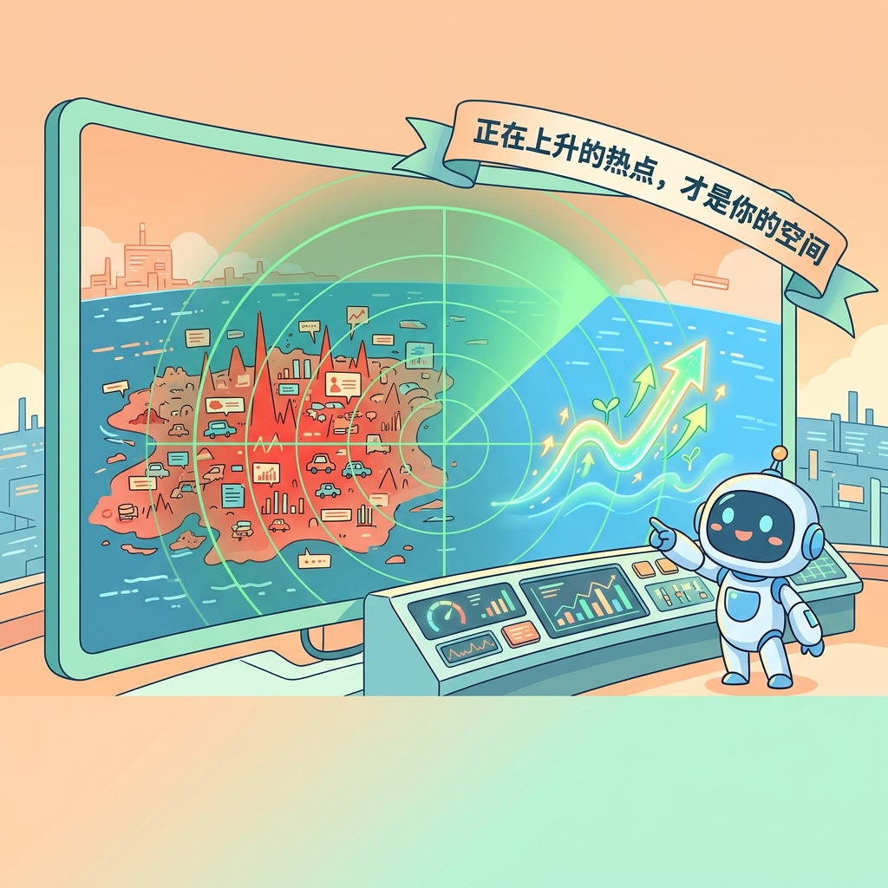
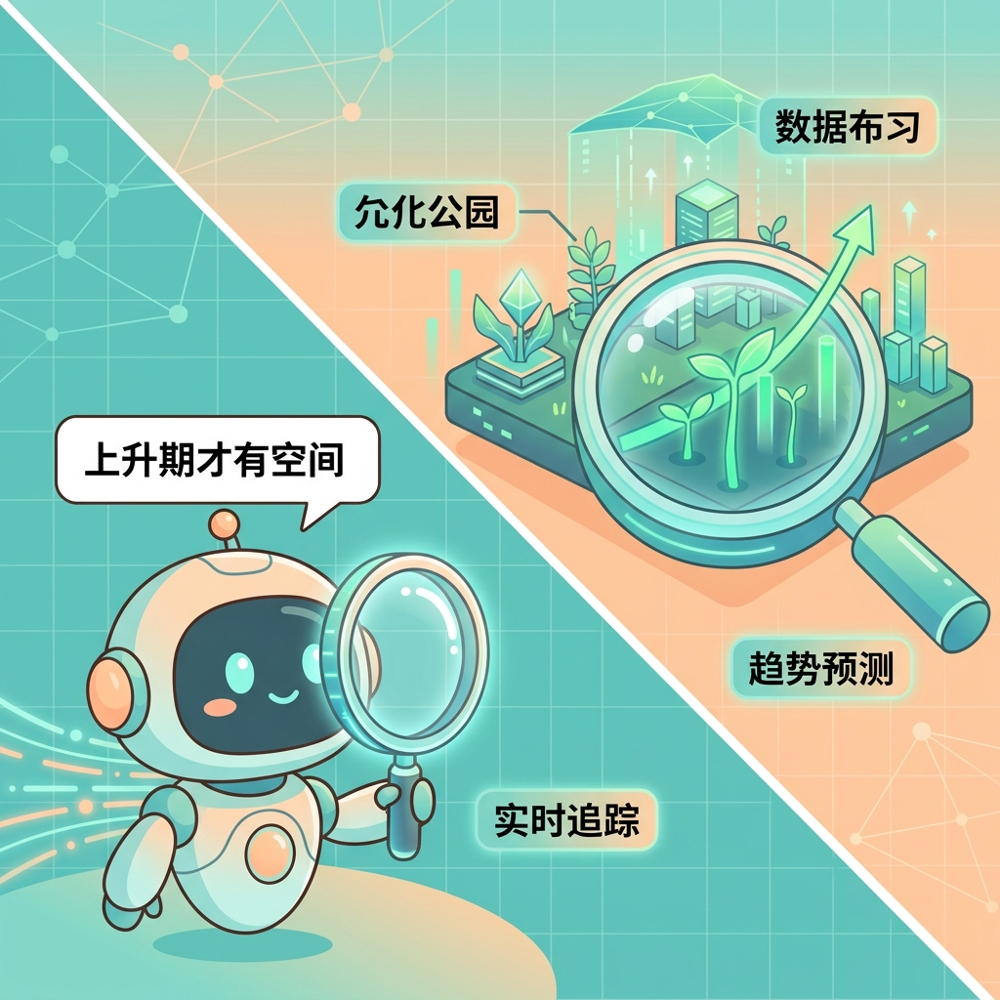

<!-- Generated from content/guides/zh/data-insights/douyin-realtime-hot-rise-2026.md. Source of truth is ai-skills-service/web/content/guides. Do not edit this file directly. -->

# 拍什么会有流量？用“抖音上升热点”技能圈定蓝海内容

> 原文链接：https://ai-skills.ai/zh/guides/data-insights/douyin-realtime-hot-rise-2026
> 分类：数据洞察
> 发布时间：2026-04-02
> 更新时间：2026-04-02
> 标签：抖音 / 选题策划 / 热门追踪 / 数据分析 / 流量红利



## 摘要

面对热门榜单里的“红海”，内容创作者真正需要的不是追热点，而是借助 AI 每隔 15 分钟的追踪，拦截属于自己赛道的“上升期”热点空间。

## 核心要点

- 了解为什么你的热点总是“追不到”且容易陷入死海竞争泥潭。
- 掌握利用 AI 大数据每 15 分钟监控专属垂直蓝海热点的极简实操。
- 建立自动化发现并拦截“上升期热点”的常态化选题机器。

## 适合谁看

- 抖音运营
- 内容策划
- 短视频创作者
- 品牌账号主理人

## 关联 Skills

- [douyin-traffic-dashboard](https://ai-skills.ai/zh/skills/douyin-traffic-dashboard?from=github-guide)
- [douyin-realtime-hot-rise](https://ai-skills.ai/zh/skills/douyin-realtime-hot-rise?from=github-guide)

## 正文

> **核心定义 (Definition)**：什么是“上升期热点”法则？它指的是在全广域网热榜引爆之前，在特定垂直赛道中刚刚呈现出**阶梯式流量增速**，且尚未被头部大 V 覆盖的长尾趋势话题。通过技术拦截处于孕育期的热点，是打破算法流量冷启动瓶颈的最有效增长策略。

“今天拍什么？”这恐怕是每一个抖音内容创作者每天醒来面临的第一个灵魂拷问。

当你打开平台的官方热点榜单时，看到的往往是已经被具有海量资源的大 V 们瓜分殆尽的“红海话题”。这种热点，头部创作者吃肉，普通中小博主连汤都喝不到。更让人绝望的是，很多全网爆火的热点，跟你自己深耕的**垂直专属赛道**（比如美妆、科技、三农、房产）八竿子打不着。

**追不到热点，就没有流量；盲目跟风硬蹭错热点，又会洗毁账号引以为傲的垂直定位标签。**

为了彻底解决这道横亘在新入场创作者面前的死局，AI Skills 正式发布：**[抖音上升热点选题助手（`douyin-realtime-hot-rise`）](https://ai-skills.ai/zh/skills/douyin-realtime-hot-rise?from=guide)**。

## 1. 为什么你总是“卷”不过别人？因为你来晚了

大多数传统运营团队的选题制作逻辑天然是滞后的：
> `看到热点爆发 ➡️ 探讨如何结合业务 ➡️ 撰写分镜脚本 ➡️ 排期拍摄剪辑`

当你耗时一天甚至几天把跟风视频做出来时，不仅同质化严重，该热点分配的**自然爆发池**也往往已经逼近干涸期，算法也已停止向中小体量的新鲜内容倾斜曝光了。

📌 **关键洞察统计：** 行业追踪数据表明，高达 **90% 的普通跟风内容死于流量衰退期的“红海绞杀”中**；而在抖音等去中心化算法平台，能够持续获得长效自然流量的，往往是那些提前 24-48 小时精准抓取信号并预留出优质内容“埋伏”在新晋成长话题下的极少数敏锐者。


## 2. 破局机制：利用大数据拦截“正在上升”的专属热点

爆款从来都不是盲目追跑出来的，而是靠着智能发掘机制“埋伏”出来的。“抖音上升热点助手”为机构乃至超级个体赋能的核心壁垒在于，它拥有对底层庞大的 **热榜走势数据分析** 特性和 **AI 智能分发预测**。它可以维持每 **15分钟** 对平台公域流量进行一次高频扫描和热力变迁比对。

它的长项不在于机械地告诉你“当下全网谁的排名是第一”，而是提前向你下达具有红利效应的预警信号：**“在你精细锁定的这块垂直品类池中，哪棵幼芽马上就要引发连锁效应了”**。
只要你抢在这个焦点彻底跨出圈层变成“国民话题”前的“上升前夜”发布优质深度内容，你就拥有极强的信息差优势，把最丰盛且生命力最绵长的一波**算法底层分发红利**稳收囊中。



## 3. 极简实操：三步建立你的爆款自动化选题库

不要再为了寻找虚无缥缈的直觉和灵感而漫无目的地刷屏了！使用内置的 `douyin-realtime-hot-rise` 技能，通过底层传递精准业务指向的标签 `tag` 参数（例如 `科技=6000`, `美食=9000`），即可将平台泛滥混波的数据噪音一键剔除。

**属于你的全新数字化内容生产流水线（Workflow）：**
1. **定向锁排赛道**：在执行请求中传入你或你的品牌核心关注的专属类目 ID（如 10000 对应旅行户外领域，30000 对应颜值生活类目等）。
2. **截获高净值曲线信号**：该技能在后端将自动对撞各内容的往期基数与当前增幅比，即刻返回一份极具“引爆拉升潜能”的小众蓝海选题追踪清单。
3. **极速投入落地创作**：拿着这份带着露水般新鲜度、经受 AI 重重过滤的热点靶点，大幅削减选题论证时间，全速起航投入拍摄与脚本拆解的落地动作。


## 4. 常见问题解答与操作避坑 (FAQ)

为帮助各位业务线操盘手在实战环境中将技能效应最大化，在此整理目前运用过程中最常遇到的疑难，这也是帮助您跨过冷启动门槛的最佳捷径：

**Q：通过本技能获取到的跟踪提示更新频率大概会是多久？是否存在信息明显滞后或断层？**
> **A：** 我们已将系统的快照轮询机制极速刷新率固定为**每 15 分钟**。这一极短的时间差，足以捕捉到任何数据突变的异动拐点，全自动化的监听哨所确保你掌握的绝对是一手带刚萌发温度的情报资源。

**Q：我的赛道受众特别局限（像聚焦老人市场的“银发人群”、或是纯农业的“三农”），这套大盘监控能覆盖掉我的方向吗？**
> **A：** 一定能够深度覆盖。此基准数据模型全面接轨平台中涵盖的全部标签一级分类标准大系。包含美妆、数码、知识教育等老牌常青藤外，支持诸如 `银发生活=32000`、`三农=22000`、`才艺=25000` 等 30 多个长短尾方向维度的精细拆分预测。

**Q：如果我今天监测到我所坚持的原方向赛道内全部缺乏快速上涨的题材榜单，是不是说明大环境改变，我需要立刻掉头更换人设或切新方向？**
> **A：** 绝非如此盲目！流量曲线只反映阶段性的短期势能分布。评估第一准则依然是问询自己此赛道是否契合你核心产品的商业变现转化。大盘探针技能的使命，就是扮演一面能让你最早感知到水位细小波澜波动的雷达屏幕。它负责报警和探测，但**战略级别的舵**,依旧需要掌握在你和团队基于优势禀赋的终极独立研判上。

## 结语：让 AI 成为整个团队运作的“网感数据中枢”

身处在以推荐匹配算法为绝对王道的主机世界中，最大的降维打击往往来自于底层工具栈落后的代际之差。到了今年，最稀缺的不再只是天马行空的分镜创意，而是如同精准巡航导弹般能够第一时间锁定目标地带的数据雷达式网感！

**“只在浪潮还未彻底翻涌之前进入，你才有随风而起的增量空间。”**

基于 AI 模型实现极高颗粒度的自动化趋势监听，足以让资源薄弱的超级独立制作者通过数据情报的信息差，对垒大批正规流水军备 MCN 机构。既然选择做，今天就先定好最精确的潮水标杆，立刻配置，让明天的增长开始事半功倍吧：

```bash
npx @yangzdpssoft/aiskills init --skill douyin-realtime-hot-rise
```

## 同步说明

- 源文件：`content/guides/zh/data-insights/douyin-realtime-hot-rise-2026.md`
- 本文件为 GitHub 文章版 markdown，由导出脚本生成。
- 如需改标题、摘要、正文或链接，请修改主站 guide 源文件后重新导出。
