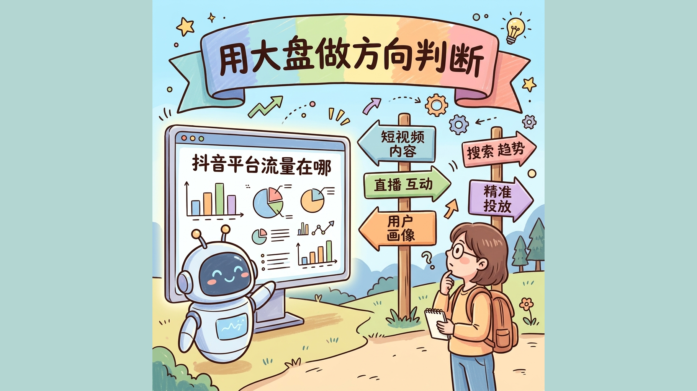
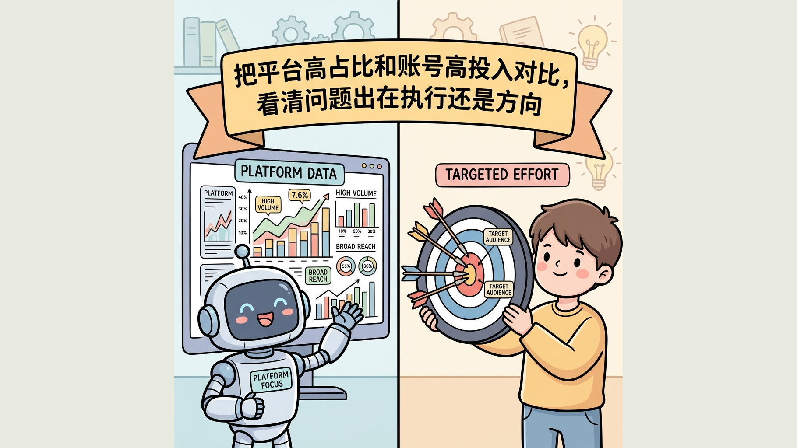
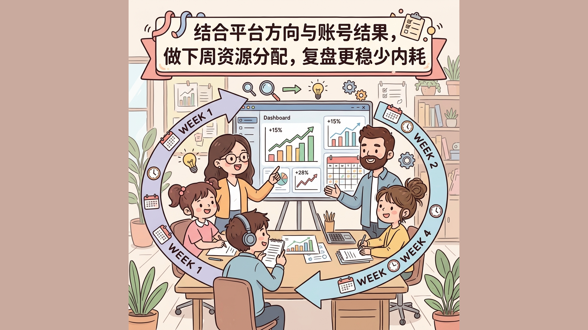

<!-- Generated from content/guides/zh/data-insights/douyin-traffic-dashboard-direction-judgment-2026.md. Source of truth is ai-skills-service/web/content/guides. Do not edit this file directly. -->

# 内容已经发了不少，但是没流量?

> 原文链接：https://ai-skills.ai/zh/guides/data-insights/douyin-traffic-dashboard-direction-judgment-2026
> 分类：数据洞察
> 发布时间：2026-03-25
> 更新时间：2026-03-25
> 标签：抖音 / 流量分配 / 账号定位 / 方向判断 / 周复盘

## 摘要

当你不知道该做哪个方向、该不该换赛道、下周该重点投什么内容时，先看平台流量分配大盘，再决定账号方向和选题投入。

## 核心要点

- 看懂什么时候该用平台流量分配大盘，而不是把它当成一张“热闹但无动作”的图表。
- 拿走一套可执行的方向判断框架，用于起号、调方向和周复盘。
- 知道看完大盘后下一步该联动哪些 Skills，而不是停在“看见数据”。

## 适合谁看

- 抖音运营
- 内容策划
- 创作者
- 品牌账号负责人

## 关联 Skills

- [douyin-traffic-dashboard](https://ai-skills.ai/zh/skills/douyin-traffic-dashboard?from=github-guide)
- [douyin-realtime-hot-rise](https://ai-skills.ai/zh/skills/douyin-realtime-hot-rise?from=github-guide)

## 正文

## 先说结论

如果你现在最困惑的是：

- 账号到底该做哪个方向
- 内容已经发了不少，但是没流量
- 周复盘时只会看自己账号数据，不知道平台的流量重心有没有变

那你应该先打开 [平台流量在哪](https://ai-skills.ai/zh/skills/douyin-traffic-dashboard?from=guide)。

这个 skill 的价值，不是告诉你“今天拍哪一个具体题目”，而是先帮你判断：**你接下来应该把内容预算、选题精力和账号定位放在哪个大方向上。**

> 热点技能解决“拍什么”，流量分配大盘先解决“你应该在哪个方向里拍”。

## 什么时候该打开这个 skill

最适合的三个时机很明确：

1. **起号前**：你还没有明确方向，或者手里有 2 到 3 个方向备选，不知道先押哪一个。
2. **调整期**：你已经在持续发内容，但增量不明显，怀疑问题不只是执行，而是方向本身就偏弱。
3. **周复盘**：你需要判断下周继续重投哪个方向、减少哪个方向、补充哪个方向的题库。

它 **不适合** 解决这些问题：

- 你只想要一个马上能拍的视频题目
- 你只想看全网正在爆的单个热点
- 你要做评论洞察、用户反馈或舆情分析

换句话说，`douyin-traffic-dashboard` 解决的是 **方向判断**，不是 **单题选题**，也不是 **评论诊断**。

## 场景一：起号前，先判断平台主流流量往哪里走

很多账号起不来，不一定是内容做得差，而是第一步就把账号放到了一个平台当前并不优先分发的方向里。

起号阶段最常见的错误不是“不会做内容”，而是：

- 一上来就凭感觉选方向
- 看见别人火了就直接复制
- 只看单条爆款，不看平台整体流量结构

这个时候，大盘的作用是帮你先回答三个问题：

1. **平台现在主要把流量给了哪些一级方向**
2. **哪些方向处在高占比、且值得继续深挖的状态**
3. **我的能力、供给和商业目标，更适合切进哪个方向**

起号时更稳的做法，不是盯着“最大分类”死冲，而是这样判断：

- 先找 **平台持续有量** 的大方向
- 再从里边找 **你有稳定供给** 的子方向
- 最后再决定账号的人设、选题池和更新节奏

比如你是品牌内容团队，看到生活、电商相关方向持续占比较高，那你的问题就不再是“要不要做内容”，而是“应该从哪类高频消费场景切进去”。这时平台流量分配大盘给你的，是方向边界，而不是题目答案。

## 场景二：内容发了不少，但迟迟不起量，用大盘判断是不是方向问题

账号进入调整期时，很多团队会陷入一个误区：看到结果不好，第一反应就是改封面、改脚本、改发布时间，结果改了一圈，方向本身还是没有变。

更有效的顺序应该是：

1. 先看平台流量重心有没有变化
2. 再看你当前主做方向是否仍在平台主流分发区
3. 最后才判断是执行问题，还是方向问题

一个实用的判断方式是把你当前内容分成三类：

- **平台大盘高占比，你自己也在做**：优先优化执行，不急着换方向
- **平台大盘高占比，但你做得很少**：说明存在漏掉的增量机会，可以补充选题池
- **平台大盘长期偏弱，而你长期重投**：要重新评估这个方向是不是仍值得做主航道

这一步的价值在于，它能帮你避免“把执行优化用在错误方向上”。有时候不是你不够努力，而是你在一个当前平台资源并不集中的方向里，试图靠更勤奋来抵消方向差。

## 场景三：把它放进每周复盘，而不是临时起意才看

平台流量分配大盘最容易被低估的一点，是它非常适合做 **周复盘的前置输入**。

如果你只是偶尔想到才去看一次，它带来的只是短期判断；但如果你每周固定看一次，它会变成一个非常稳的方向校准器。

建议把它放进每周复盘的前三步：

1. **先看平台大盘**：确认本周平台重点流量方向有没有变化
2. **再看账号数据**：对比你本周内容产出集中在哪些方向
3. **最后做资源分配**：决定下周加码、维持还是缩减

一个够用的周复盘问题清单是：

- 我们这周主做的方向，是否仍在平台主流流量带内？
- 我们是否忽略了一个已经明显上升的大方向？
- 下周应该继续重投原方向，还是增加一个更有量的辅助方向？

这样做的价值是，团队不会再只围绕“哪条视频好、哪条视频差”争论，而是先统一对 **平台方向变化** 的判断。

## 一个够用的判断表

| 你眼前的问题 | 先看什么信号 | 更合理的动作 |
| --- | --- | --- |
| 新号不知道先做哪个方向 | 哪些一级方向长期有量，且与你的供给能力匹配 | 先定主方向，再做题库和栏目规划 |
| 做了很多内容但起量慢 | 平台主流方向与你当前主做方向是否一致 | 如果不一致，先调方向，再调执行 |
| 周复盘总在吵哪条视频好坏 | 平台流量是否出现明显重心变化 | 用平台变化校准下周投入比例 |
| 想追热点但怕追偏 | 先看大方向，再决定是否进入具体热点 | 先定赛道，再去找具体题目 |

## 常见误区

### 误区一：把大盘当成热点榜

热点榜是看“此刻什么最火”，大盘看的是“平台整体流量重心在哪”。两者相关，但不是一回事。

### 误区二：看到高占比方向就机械跟进

高占比不等于你必须做。更重要的是：这个方向你是否有稳定供给、是否符合账号长期定位、是否和业务目标一致。

### 误区三：只在数据差的时候才看

真正有价值的用法，是固定周期看，形成持续判断，而不是把它当成结果不好时的临时补救。

### 误区四：看完就结束，没有后续动作

大盘负责做方向判断，下一步应该进入具体选题、热点拆解或执行排期，否则数据不会自动变成增长。

## 看完后直接执行的动作清单

1. 打开 [平台流量在哪](https://ai-skills.ai/zh/skills/douyin-traffic-dashboard?from=guide)，先看当前平台大方向分布。
2. 列出你现在正在做的 3 个方向，判断它们分别属于高占比、观察区还是弱势区。
3. 给每个方向写一句结论：继续重投、保留观察、逐步缩减。
4. 为下周补 1 个与平台主流方向更接近的选题池，而不是只在原方向里反复内卷。
5. 下周复盘时再次回看大盘，判断调整是否有效。

## 下一步怎么接其他 Skills

看完方向以后，下一步通常不是结束，而是进入更细的动作。

- 如果你已经知道大方向，要找更细的题目，可以继续用 [抖音上升热点选题助手](https://ai-skills.ai/zh/skills/douyin-realtime-hot-rise?from=guide)。
- 如果你想先看全网当前最热的话题，再决定要不要切入，可以看 [现在最热门的是什么](https://ai-skills.ai/zh/skills/douyin-hotlist-overall?from=guide)。
- 如果你的问题已经从“做哪个方向”进入“这个方向里拍什么”，那就不要停在大盘页，应该继续往具体题目层走。

## FAQ

### Q：平台流量分配大盘适合每天看吗？

可以，但更推荐把它放进固定节奏，比如每周复盘或每次方向调整前。它更像“方向校准器”，而不是“每小时刷新一次的追热点工具”。

### Q：看到自己的方向不在高占比区，是不是要立刻换赛道？

不一定。你要先判断这个方向是不是你的核心优势、商业目标是否匹配、以及平台分配变化是短期波动还是持续偏移。大盘的作用是帮你更早发现问题，而不是替你做机械切换。

## 同步说明

- 源文件：`content/guides/zh/data-insights/douyin-traffic-dashboard-direction-judgment-2026.md`
- 本文件为 GitHub 文章版 markdown，由导出脚本生成。
- 如需改标题、摘要、正文或链接，请修改主站 guide 源文件后重新导出。
