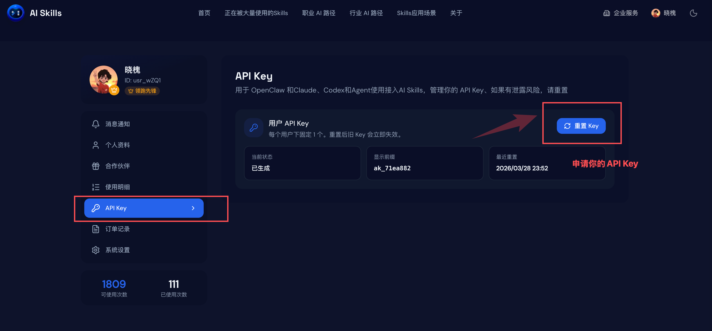

# AI Skills 技能库：为每一个场景做真正有价值的AI技能库

> 大多数人用 AI 还停在「问一句答一句」。AI Skills（[ai-skills.ai](https://ai-skills.ai/)）想换一种姿势：把 AI 能力拆成一条条能直接执行的 Skill，像查字典一样调出来用。无论你从 AI Skills 官网、skills.sh 还是 ClawHub 进入，先按这 5 步完成接入，再继续看当前技能说明。


## 快速开始

### 1. 扫码登录


先在 AI Skills 官网完成扫码登录，确保后续 API Key、安装命令和技能调用都绑定到同一个账号。

### 2. 申请 API Key



登录后进入 API Key 页面申请密钥，后续 CLI 安装和运行技能都会读取 AISKILLS_API_KEY。

### 3. 复制安装命令


在 AI Skills 官网、skills.sh 或 ClawHub 页面复制安装命令，优先使用官方 CLI，避免手动拼接参数。

### 4. 执行安装命令


回到终端执行安装命令，CLI 会写入 AISKILLS_API_KEY，并调用下游 skills add 完成技能安装。

### 5. 成功获取技能


安装成功后，你会在 agent 的技能列表里看到对应 Skill，可以直接调用并复用到工作流中。

## 当前技能：douyin-hotlist-overall

### 概述

抖音全网实时热点

### 什么时候使用

**适用场景**

- the user asks what is hottest right now
- the user asks what everyone is watching today
- the user wants a real-time hot topic scan

**典型用户提问**

- 现在最热门的是什么？
- 抖音热搜最近在刷什么？
- 给我看下当前最火的内容方向

**不要用于**

- the user wants rising-trend detection
- the user wants platform traffic structure
- the user wants comment diagnosis

**相邻技能选择**

- use `douyin-realtime-hot-rise` for rising trends
- use `douyin-traffic-dashboard` for traffic distribution

### 调用方式

通过导出的 Python runner 直接调用 AI Skills API：

### 命令示例

**获取实时热榜**

```bash
python3 scripts/run.py --params '{}'
```

### 参数说明

当前技能无需额外参数，可直接使用：

```bash
python3 scripts/run.py --params '{}'
```

### 参数取值参考

当前技能没有需要额外查表的分类参数。

### 支持的输入格式

当前技能直接接收 JSON 参数，不涉及分享链接解析。

### 示例请求

下面的示例参数可直接传给 `scripts/run.py`，runner 会把它们发送给 AI Skills API。

```bash
python3 scripts/run.py --params '{}'
```

等价的 `--params` JSON：

```json
{}
```

### 返回结果示例

```json
{
  "success": true,
  "data": {
    "title": "抖音热搜总榜",
    "updateTime": "2026-04-24T11:30:00.000Z",
    "wordList": [
      {
        "position": 1,
        "word": "奥运开幕式",
        "hotValue": 9876543,
        "label": 1,
        "videoCount": 12860,
        "eventTime": "2026-04-24T11:28:00.000Z",
        "sentenceTag": 5000,
        "groupId": "1",
        "sentenceId": "743001"
      }
    ],
    "trendingList": [
      {
        "position": 2,
        "word": "巴黎街采",
        "hotValue": 6321880,
        "label": 0,
        "videoCount": 5840,
        "eventTime": "2026-04-24T11:25:00.000Z",
        "sentenceTag": 10000,
        "groupId": "2",
        "sentenceId": "743002"
      }
    ]
  },
  "meta": {
    "executionTime": 842,
    "cached": false
  }
}
```

### 结果重点看什么

- `data.wordList`：抖音热搜总榜主列表，优先看前几名关键词和热度值。
- `data.trendingList`：实时上升中的热点，适合抓新趋势和临时选题。
- `data.updateTime`：本次榜单更新时间，便于判断结果新鲜度。

### 运行前准备

- `AISKILLS_BASE_URL`：默认 `https://ai-skills.ai`
- `AISKILLS_API_KEY`：必填，用于认证调用
- `AISKILLS_TENANT_ID`：默认 `default`

### 备注

当前导出包由 AI Skills 站点目录自动生成，运行时后端仍然指向 `douyin-hotlist-overall` 对应的 AI Skills API/工作流。
