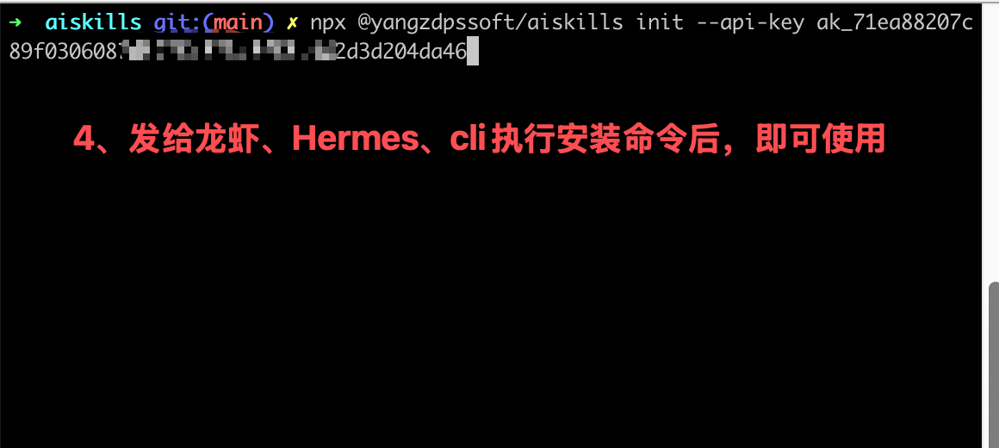
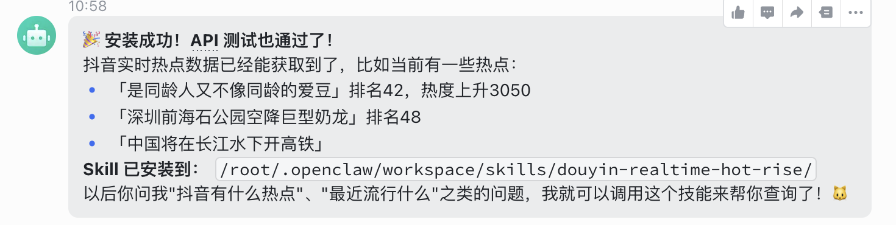

# AI Skills 技能库：为每一个场景做真正有价值的AI技能库

> 大多数人用 AI 还停在「问一句答一句」。AI Skills（[ai-skills.ai](https://ai-skills.ai/)）想换一种姿势：把 AI 能力拆成一条条能直接执行的 Skill，像查字典一样调出来用。无论你从 AI Skills 官网、skills.sh 还是 ClawHub 进入，先按这 5 步完成接入，再继续看当前技能说明。

## 5 步接入 AI Skills

### 1. 扫码登录

先在 AI Skills 官网完成扫码登录，确保后续 API Key、安装命令和技能调用都绑定到同一个账号。

### 2. 申请 API Key

登录后进入 API Key 页面申请密钥，后续 CLI 安装和运行技能都会读取 AISKILLS_API_KEY。

### 3. 复制安装命令

在 AI Skills 官网、skills.sh 或 ClawHub 页面复制安装命令，优先使用官方 CLI，避免手动拼接参数。

### 4. 执行安装命令

回到终端执行安装命令，CLI 会写入 AISKILLS_API_KEY，并调用下游 skills add 完成技能安装。

### 5. 成功获取技能

安装成功后，你会在 agent 的技能列表里看到对应 Skill，可以直接调用并复用到工作流中。

## 当前技能：software-dev-cost-dashboard

### Overview

软件成本评估看板

### Invocation Mode

This skill uses `external-link` invocation.

### Authentication

Set these environment variables before running the packaged runner:

- `AISKILLS_BASE_URL` (default: `https://ai-skills.ai`)
- `AISKILLS_API_KEY` (required for authenticated API calls)
- `AISKILLS_TENANT_ID` (default: `default`)

### Parameters

Read `references/form-schema.json` for the current machine-readable input schema.

### Execution

Run `python3 scripts/run.py --params '{}'` for $software-dev-cost-dashboard.

### Notes

This package was generated from AI Skills catalog metadata and keeps AI Skills APIs as the runtime backend for `software-dev-cost-dashboard`.
